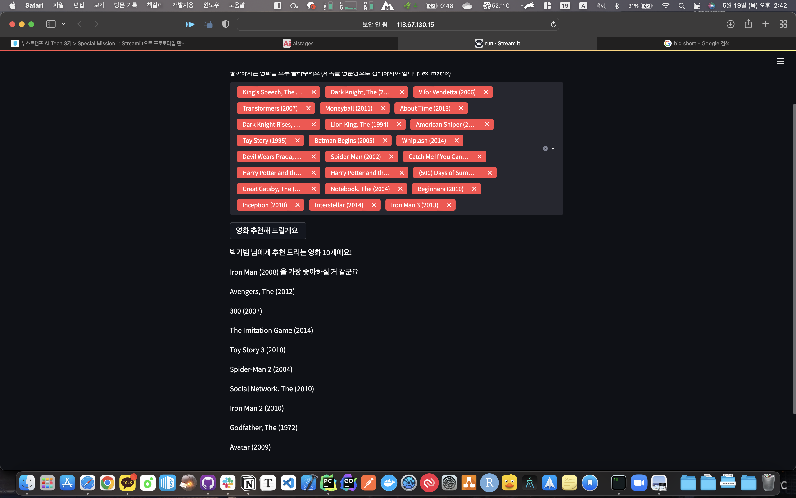

# streamlit movie recommendation

## Data

- MovieLens 20M
- preprocessing explicit to implicit

## Model

- EASE

## How to use?

- make `.env` file
  - `SM_CHANNEL_DATA` = data path
- go to `run.py` path
- `streamlit run run.py`

## Demo Image

